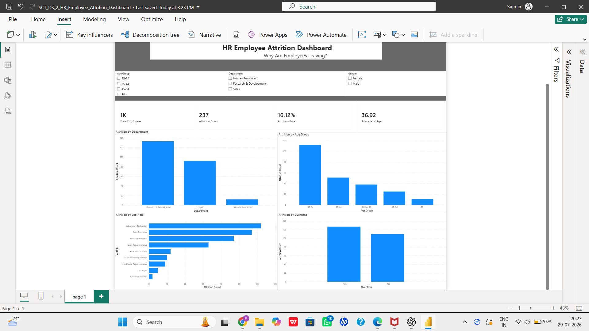

# 📊 HR Employee Attrition Dashboard

An interactive **HR Employee Attrition Analysis Dashboard** built with **Microsoft Power BI** to explore employee turnover patterns and identify factors associated with employee attrition.

---

## 📌 Project Overview

Employee attrition is an important challenge for organizations because high employee turnover can affect productivity, costs, and team performance.

This project uses HR employee data to create an interactive dashboard that helps analyze:

- Which departments have higher attrition?
- Which age groups are leaving more?
- Which job roles have higher employee turnover?
- Does overtime relate to employee attrition?
- What is the overall employee attrition rate?

---

## 🎯 Objectives

The main objective of this project is to create an interactive visualization that answers:

> **"Why are employees leaving?"**

The dashboard allows users to explore employee attrition using different categories and filters.

---

## 📊 Dashboard Preview



---

## 🔑 Key Performance Indicators

| KPI | Value |
|---|---:|
| 👥 Total Employees | 1,470 |
| 🚪 Attrition Count | 237 |
| 📉 Attrition Rate | 16.12% |
| 🎂 Average Age | 36.92 |

---

## 📈 Dashboard Visualizations

The dashboard contains the following visualizations:

### 1. Attrition by Department
Compares employee attrition across:

- Research & Development
- Sales
- Human Resources

### 2. Attrition by Age Group
Analyzes employee turnover across different age groups:

- Under 25
- 25–34
- 35–44
- 45–54
- 55+

### 3. Attrition by Job Role
Identifies job roles with comparatively higher employee attrition.

### 4. Attrition by Overtime
Compares attrition between employees who work overtime and those who do not.

---

## 🎛️ Interactive Filters

Users can interact with the dashboard using:

- **Department**
- **Age Group**
- **Gender**

Selecting a filter dynamically updates the dashboard visualizations.

---

## 💡 Key Insights

The dashboard helps identify several important patterns:

- Employee attrition varies significantly across departments.
- The **25–34 age group** shows comparatively higher attrition.
- Some job roles experience considerably higher employee turnover.
- **Overtime** is an important factor associated with employee attrition.
- The overall attrition rate is **16.12%**.

> These insights are based on the visual analysis of the dataset and are intended to help understand employee turnover patterns.

---

## 🗂️ Dataset

The project uses the **IBM HR Analytics Employee Attrition & Performance** dataset.

The dataset contains employee-related information such as:

- Age
- Gender
- Department
- Job Role
- Job Satisfaction
- Monthly Income
- OverTime
- Years at Company
- Attrition

---

## 🛠️ Tools & Technologies

- **Microsoft Power BI**
- **Power Query**
- **DAX**
- **CSV Dataset**

---

## 📁 Project Structure

```text
HR-Employee-Attrition-Dashboard/
│
├── SCT_DS_2_HR_Employee_Attrition_Dashboard.pbix
├── dashboard.png
└── README.md
